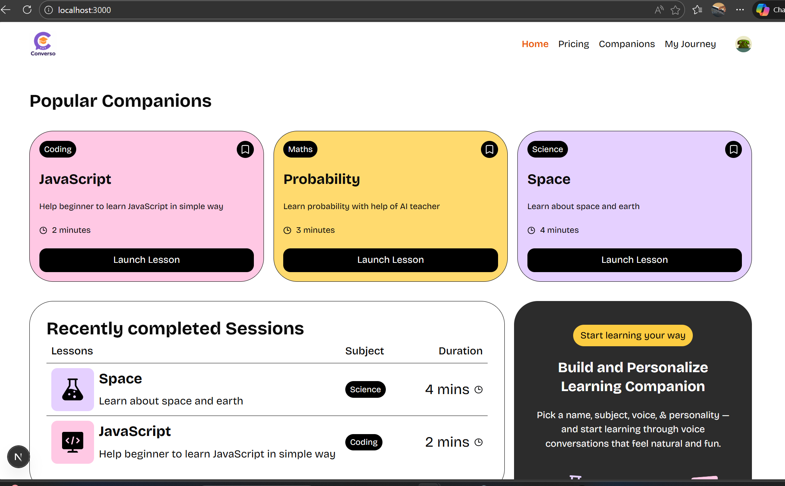
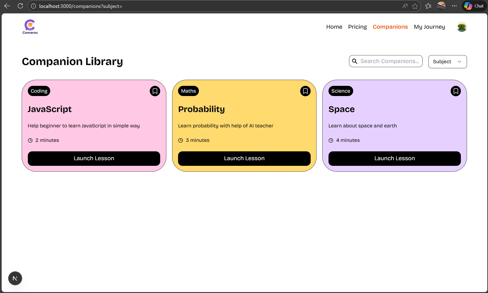
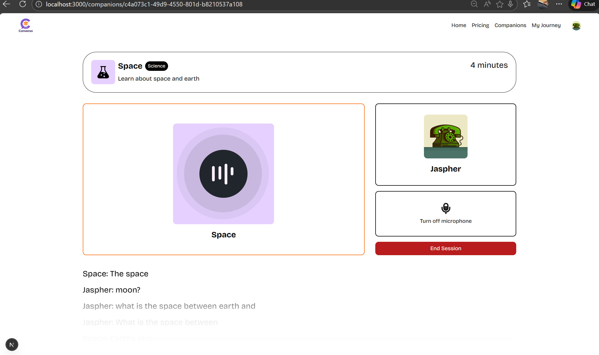
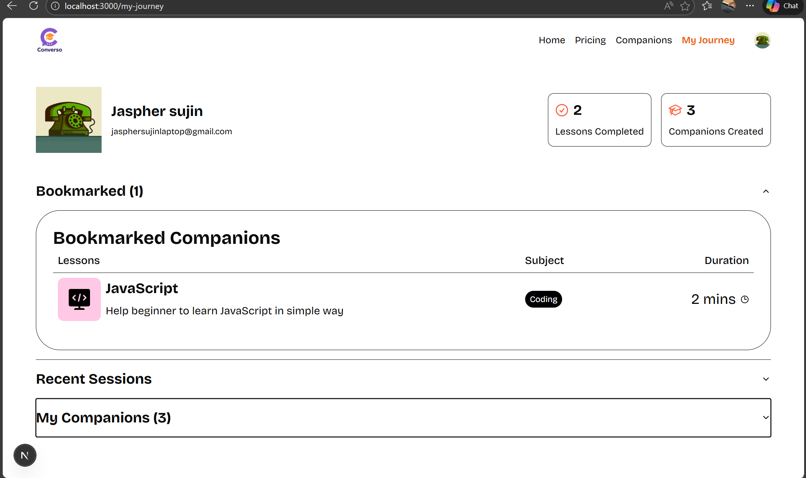
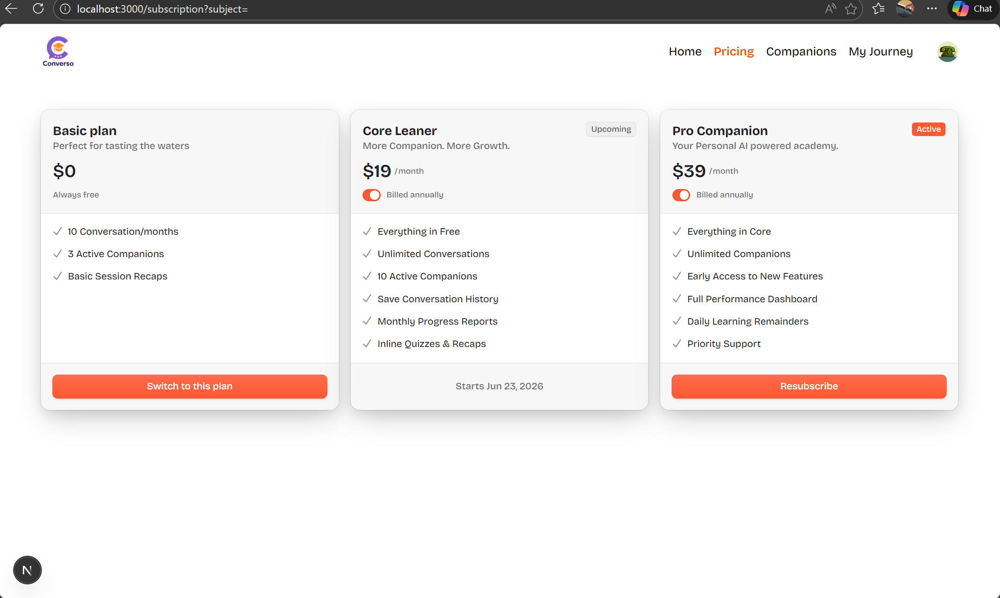

This is a [Next.js](https://nextjs.org) project bootstrapped with [`create-next-app`](https://nextjs.org/docs/app/api-reference/cli/create-next-app).

## Getting Started

First, run the development server:

```bash
npm run dev
# or
yarn dev
# or
pnpm dev
# or
bun dev
```

## Screenshots

Below are some screenshots showcasing the main features and UI of the application.

### Home Page


### Companions Page


### Companion Learning View


### User Profile


### Subscription Page


Open [http://localhost:3000](http://localhost:3000) with your browser to see the result.

You can start editing the page by modifying `app/page.tsx`. The page auto-updates as you edit the file.

This project uses [`next/font`](https://nextjs.org/docs/app/building-your-application/optimizing/fonts) to automatically optimize and load [Geist](https://vercel.com/font), a new font family for Vercel.

## Learn More

To learn more about Next.js, take a look at the following resources:

- [Next.js Documentation](https://nextjs.org/docs) - learn about Next.js features and API.
- [Learn Next.js](https://nextjs.org/learn) - an interactive Next.js tutorial.

You can check out [the Next.js GitHub repository](https://github.com/vercel/next.js) - your feedback and contributions are welcome!

## Deploy on Vercel

The easiest way to deploy your Next.js app is to use the [Vercel Platform](https://vercel.com/new?utm_medium=default-template&filter=next.js&utm_source=create-next-app&utm_campaign=create-next-app-readme) from the creators of Next.js.

Check out our [Next.js deployment documentation](https://nextjs.org/docs/app/building-your-application/deploying) for more details.


# AI-Powered LMS with Real-Time Voice Intelligence

A modern Learning Management System (LMS) built with Next.js, Clerk Authentication, Supabase, and Vapi AI. The platform enables users to learn through AI-powered voice interactions, track progress, manage subscriptions, and interact with intelligent learning companions in real time.

## Features

* AI-powered voice learning companions
* Real-time voice interactions and transcription
* Secure authentication with Clerk
* Course progress tracking
* Bookmark and personalized learning features
* Subscription and billing management
* Responsive and modern user experience
* Error monitoring with Sentry

---

## Screenshots

### Home Page

### Companions Page

### Companion Learning View

### User Profile

### Subscription Page

---

## Tech Stack

### Frontend

* Next.js 15
* React 19
* TypeScript
* Tailwind CSS

### Authentication

* Clerk

### Database

* Supabase

### AI & Voice

* Vapi AI

### Monitoring

* Sentry

### Form Validation

* React Hook Form
* Zod

---

## Installation

### Clone the Repository

```bash
git clone <repository-url>

cd js_saas_app
```

### Install Dependencies

```bash
npm install
```

### Configure Environment Variables

Create a `.env.local` file and configure:

```env
NEXT_PUBLIC_CLERK_PUBLISHABLE_KEY=
CLERK_SECRET_KEY=

NEXT_PUBLIC_SUPABASE_URL=
NEXT_PUBLIC_SUPABASE_ANON_KEY=

NEXT_PUBLIC_VAPI_WEB_TOKEN=
NEXT_PUBLIC_VAPI_WORKFLOW_ID=

SENTRY_AUTH_TOKEN=
```

### Run Development Server

```bash
npm run dev
```

Open:

```text
http://localhost:3000
```

---

## Production Build

```bash
npm run build
```

```bash
npm start
```

---

## Available Scripts

```bash
npm run dev
npm run build
npm run start
npm run lint
```

